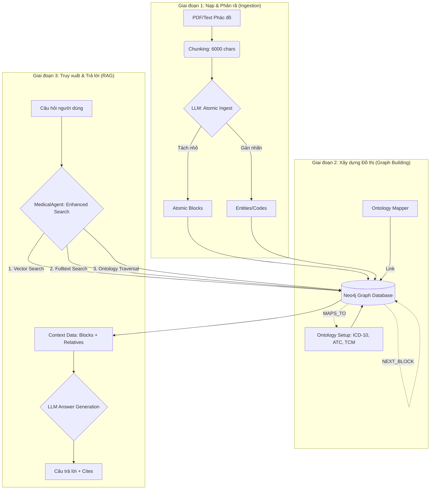
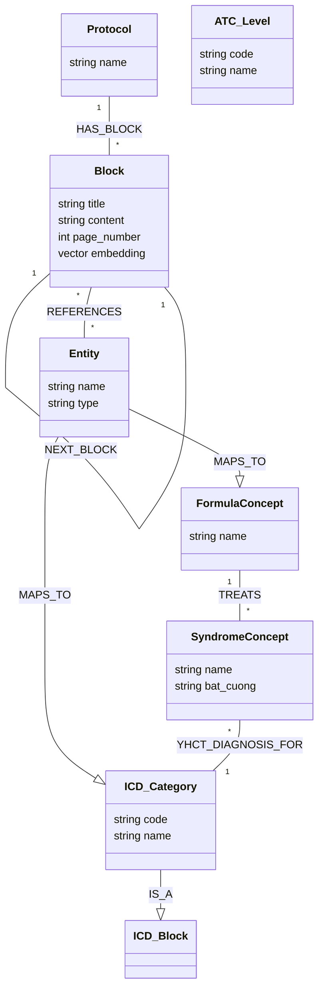

# Clinical Ontology & Graph-RAG

Chi tiết quy trình từ lúc nạp dữ liệu thô (PDF phác đồ) cho đến khi hệ thống trích xuất tri thức để trả lời câu hỏi lâm sàng thông qua đồ thị tri thức (Knowledge Graph).

---

## 1. Sơ đồ Tổng quan (Mermaid Diagram)

---

## 2. Kiến trúc Clinical Ontology (Schema)

Sơ đồ dưới đây mô tả cấu trúc phân cấp và các lớp tri thức trong hệ thống:

## 3. Quy trình Chi tiết các Bước

### Bước 1: Atomic Ingestion (Phân rã Nguyên tử)

- **Chunking**: Văn bản phác đồ dài được chia thành các đoạn nhỏ (chunks) 6000 ký tự với 500 ký tự gối đầu (overlap) để đảm bảo không mất ngữ cảnh giữa các trang.
- **LLM Processing**: Sử dụng `gpt-4o-mini` để phân tích từng chunk thành các **Atomic Block**.
  - _Tiêu chuẩn_: Mỗi thể bệnh (syndrome), mỗi bài thuốc (formula), mỗi phương pháp (treatment) phải là 1 block riêng biệt.
  - _Trích xuất thực thể_: Tự động nhận diện thuốc, huyệt, mã bệnh có trong block.

### Bước 2: Kiến trúc Đồ thị (Graph Database)

- **Nodes (Nút)**:
  - `Protocol`: Tên tài liệu gốc.
  - `Block`: Đoạn văn bản chứa nội dung chuyên môn.
  - `Entity`: Các thực thể thực tế tìm thấy (ví dụ: "Diazepam", "Quy tỳ thang").
  - `Concept`: Các khái niệm chuẩn trong Ontology (ví dụ: mã G47, mã ATC N05B).
- **Relationships (Mối quan hệ)**:
  - `HAS_BLOCK`: Liên kết tài liệu với nội dung.
  - `NEXT_BLOCK`: Chuỗi liên kết tuần tự giữa các đoạn (đảm bảo tính liền mạch).
  - `REFERENCES`: Block nhắc đến thực thể nào.
  - `MAPS_TO` / `INSTANCE_OF`: Ánh xạ từ thực thể thực tế lên khung tri thức chuẩn.

### Bước 3: Semantic Ontology Mapping

- **Ontology Setup**: Khởi tạo cây phân cấp cho ICD-10 (Bệnh) và ATC (Thuốc). Đối với YHCT, xây dựng cây Thể bệnh -> Bài thuốc.
- **Mapper**: Chạy các thuật toán so khớp (keyword matching, synonym) để nối các thực thể rời rạc vào đúng vị trí trong cây phân cấp. Ví dụ: Từ "Mất ngủ" trong văn bản sẽ được nối vào mã `G47` trong Ontology.

### Bước 4: Enhanced Clinical Search (Truy xuất Nâng cao)

Khi người dùng đặt câu hỏi, `MedicalAgent` thực hiện tìm kiếm kết hợp (**Hybrid Search**):

1. **Vector Search**: Tìm các đoạn có ý nghĩa ngữ nghĩa gần nhất với câu hỏi.
2. **Fulltext Search**: Tìm chính xác các từ khóa y khoa (tên thuốc, mã bệnh).
3. **Ontology Expansion**: Nếu tìm thấy một "Thể bệnh", hệ thống sẽ tự động truy vấn thêm các "Bài thuốc" liên quan trong đồ thị, dù trong đoạn văn bản gốc có thể không nhắc tới cùng lúc.
4. **NEXT_BLOCK Context**: Tự động lấy thêm đoạn văn trước và sau đoạn tìm được để cung cấp ngữ cảnh đầy đủ nhất cho LLM.

### Bước 5: Chấm điểm & Đánh giá (Judge)

- Sử dụng một LLM độc lập (ví dụ: Gemini hoặc GPT-5-mini) để đóng vai Giám khảo.
- So sánh câu trả lời của AI với Đáp án chuẩn dựa trên 5 cấp độ (0, 0.25, 0.5, 0.75, 1.0).
- Chấp nhận các từ đồng nghĩa y khoa (ví dụ: "kiện tỳ" = "bổ tỳ") để đánh giá chính xác năng lực thực tế.

---

_Tài liệu được cập nhật bởi Antigravity AI - 18/03/2026_
